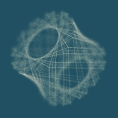

# lineart
Results of my first play around rendering images using random sampling:

And my first aesthetic mistake:

## Credit:

All actual image generation done using the lovely and lightweight [Flat](https://xxyxyz.org/flat) by Xxyxyz.

Heavily inspired by the work of Anders Hoff at [Inconvergent](https://inconvergent.net/)

